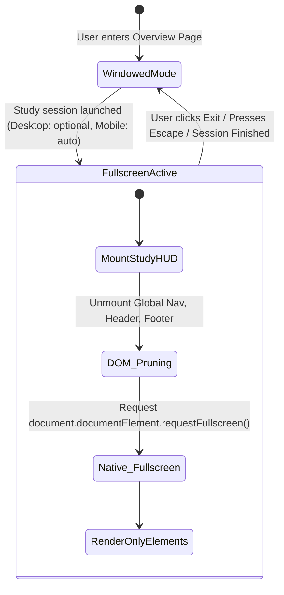

# Technical Requirements Document (TRD)
# A is Impossible — Medical Learning Platform

**Document Version:** 1.0 (Final Architecture Baseline)  
**Classification:** Technical / Engineering Architecture Specification  
**Source of Truth:** Approved Final Architecture v3.0 & Approved PRD v1.0  
**Target Audience:** Infrastructure Engineers, Full-Stack Developers, Database Architects, AI Coding Agents  

---

## 1. Technical Architecture

### 1.1 High-Level System Topology

The platform operates on a decoupled client-server architecture with an edge-accelerated persistence tier:

```
┌─────────────────────────────────────────────────────────────────────────────┐
│                                CLIENT TIER                                  │
│  React / Next.js Web Application • TypeScript • Virtualized Canvas Engine   │
│  State: TanStack Query (SWR Cache) + Zustand (Session / Fullscreen HUD)     │
└──────────────────────┬───────────────────────────────┬──────────────────────┘
                       │ HTTPS / WSS                   │ Direct Read (CDN)
                       ▼                               ▼
┌─────────────────────────────────────────┐   ┌───────────────────────────────┐
│              EDGE / ROUTING             │   │       OBJECT STORAGE CDN      │
│  Cloudflare Edge / Vercel Edge Runtime  │   │  Cloudflare R2 / S3 Storage   │
│  Static Asset Cache • Auth Token Guards │   │  Lecture Slides (PDFs)        │
│  Rate Limiting • SSL Termination        │   │  Clinical Histology Images    │
└──────────────────────┬──────────────────┘   └───────────────────────────────┘
                       │
                       ▼
┌─────────────────────────────────────────────────────────────────────────────┐
│                            APPLICATION / API TIER                           │
│  Next.js Server Actions / REST API / Supabase PostgREST Gateway             │
│  JWT Verification • Business Validation • Ingestion Markdown Parsers        │
└──────────────────────┬──────────────────────────────────────────────────────┘
                       │ Connection Pool (PgBouncer)
                       ▼
┌─────────────────────────────────────────────────────────────────────────────┐
│                            PERSISTENCE TIER (DB)                            │
│  PostgreSQL 15+ (Supabase Managed Engine)                                   │
│  Row-Level Security (RLS) • GIN Full-Text Indexing • ACID Transactions      │
└─────────────────────────────────────────────────────────────────────────────┘
```

### 1.2 Core Technology Stack
- **Client Application:** React 18+ / Next.js (App Router), TypeScript (Strict Mode).
- **Styling Architecture:** Vanilla CSS / CSS Modules with design tokens (zero heavy CSS utility runtimes to maximize rendering performance).
- **PDF Engine:** `pdfjs-dist` (Mozilla PDF.js) utilizing HTML5 Canvas with custom viewport virtualization.
- **Data & State Management:**
  - Remote Server State: TanStack Query (React Query) with 5-minute stale-while-revalidate caching.
  - Transient UI State (Fullscreen HUD, Study Mode, Active Question Palette): Zustand store.
  - Local Resilience Cache: `localStorage` / IndexedDB for offline attempt preservation.
- **Database & Auth:** PostgreSQL 15+ via Supabase, with built-in GoTrue auth engine and connection pooling.
- **Asset Storage:** S3-compatible Object Storage (Cloudflare R2 / Supabase Storage) fronted by Cloudflare CDN.

---

## 2. Routing Architecture

The application strictly avoids hash routing and single-page state bags, enforcing human-readable, semantic, deep-linkable canonical URLs.

### 2.1 Route Map & Route Handler Specifications

| Route Path | View / Component | Access Level | Data Dependencies |
| :--- | :--- | :--- | :--- |
| `/` | Landing / Redirect | Public | Redirects to `/dashboard` if authed, else marketing landing |
| `/dashboard` | Student Dashboard | Authenticated | User metrics, active modules, announcements |
| `/library` | Library Split Index | Authenticated / Guest | High-level module metadata, user deck summaries |
| `/library/official` | Official Curriculum Root | Authenticated / Guest | Year 2 Modules list + aggregate progress |
| `/library/official/:module` | Module Subject Overview | Authenticated / Guest | Module metadata, subject list, formative exams |
| `/library/official/:module/:subject` | Subject Weekly Feed | Authenticated / Guest | Subject metadata, weeks list, lecture cards |
| `/library/official/:module/formative-exams` | Formative Exams Subject Feed| Authenticated / Guest | Weeks list under Formative Exams subject |
| `/lecture/:module/:subject/:week/:lecture` | **Lecture Overview Page** | Authenticated / Guest | Lecture metadata, PDF metadata, dual track stats |
| `/lecture/:module/:subject/:week/:lecture/pdf` | Dedicated PDF Viewer | Authenticated (Preview: Guest) | Secure PDF stream URL |
| `/lecture/:module/:subject/:week/:lecture/practice` | Practice Questions HUD | Authenticated | Questions (`version_type = 'practice'`), options |
| `/lecture/:module/:subject/:week/:lecture/university-exam-style` | University Exam Style HUD | Authenticated | Questions (`version_type = 'university_exam_style'`), options |
| `/lecture/:module/:subject/:week/:lecture/review/:session_id` | Post-Exam Review Page | Authenticated | Session attempt history, correct keys |
| `/library/my-content` | My Content Root | Authenticated | User decks, imported decks, user PDFs |
| `/library/my-content/decks/:deck_id` | Personal Deck Study View | Authenticated | Personal card records |
| `/library/favorites` | Starred Questions Collection| Authenticated | User favorites cross-referenced with questions |
| `/library/disliked` | Disliked Questions Collection | Authenticated | User dislikes cross-referenced with questions |
| `/admin` | Admin Dashboard | Admin Only | System KPIs, active users, traffic summaries |
| `/admin/content` | Admin Curriculum Manager | Admin Only | Full curriculum tree (Draft/Published/Hidden) |
| `/admin/content/new` | Lecture Publishing Wizard | Admin Only | Module/Subject/Week lookup |
| `/admin/content/edit/:lecture_id` | Lecture Editor | Admin Only | Target lecture record, PDF, questions pool |
| `/admin/analytics` | Deep Curriculum Analytics | Admin Only | PDF views, dislike QA queues, difficulty stats |
| `/admin/users` | User & Whitelist Admin | Admin Only | User directory, attempt resets, admin whitelist |
| `/admin/announcements` | Announcement Manager | Admin Only | Active/Expired platform notices |

---

## 3. Official Content Data Model

Official content represents the accredited curriculum. All records are admin-managed, immutable to students, and hierarchically strict.

```mermaid
erDiagram
    academic_years ||--o{ modules : contains
    modules ||--o{ subjects : contains
    subjects ||--o{ subject_weeks : contains
    subject_weeks ||--o{ lectures : contains
    lectures ||--o{ questions : contains
    questions ||--o{ question_options : contains

    academic_years {
        uuid id PK
        varchar code
        varchar title
        boolean is_active
        int display_order
    }

    modules {
        uuid id PK
        uuid year_id FK
        varchar slug
        varchar title
        text description
        varchar icon_name
        int display_order
    }

    subjects {
        uuid id PK
        uuid module_id FK
        varchar slug
        varchar title
        boolean is_formative_exam
        int display_order
    }

    subject_weeks {
        uuid id PK
        uuid subject_id FK
        int week_number
        varchar slug
        varchar title
        int display_order
    }

    lectures {
        uuid id PK
        uuid week_id FK
        varchar slug
        varchar title
        text description
        text pdf_url
        int pdf_page_count
        bigint pdf_file_size_bytes
        content_status status
        int display_order
        bigint view_count
        bigint pdf_view_count
    }

    questions {
        uuid id PK
        uuid lecture_id FK
        question_version_type version_type
        text stem
        text image_url
        int display_order
    }

    question_options {
        uuid id PK
        uuid question_id FK
        char option_letter
        text content
        boolean is_correct
        int display_order
    }
```



---

## 4. My Content Data Model

My Content is strictly partitioned from Official Content. Every record is scoped to the creating user (`user_id`). Zero foreign keys exist between My Content records and Official Content records.

```sql
-- 1. Personal Decks
CREATE TABLE user_decks (
    id UUID PRIMARY KEY DEFAULT gen_random_uuid(),
    user_id UUID NOT NULL REFERENCES auth.users(id) ON DELETE CASCADE,
    title VARCHAR(255) NOT NULL,
    description TEXT,
    card_count INT NOT NULL DEFAULT 0,
    created_at TIMESTAMPTZ NOT NULL DEFAULT now(),
    updated_at TIMESTAMPTZ NOT NULL DEFAULT now()
);

-- 2. Personal Cards
CREATE TABLE user_cards (
    id UUID PRIMARY KEY DEFAULT gen_random_uuid(),
    deck_id UUID NOT NULL REFERENCES user_decks(id) ON DELETE CASCADE,
    user_id UUID NOT NULL REFERENCES auth.users(id) ON DELETE CASCADE,
    front_text TEXT NOT NULL,
    back_text TEXT NOT NULL,
    display_order INT NOT NULL DEFAULT 0,
    created_at TIMESTAMPTZ NOT NULL DEFAULT now(),
    updated_at TIMESTAMPTZ NOT NULL DEFAULT now()
);

-- 3. External Imports Ledger
CREATE TABLE user_imports (
    id UUID PRIMARY KEY DEFAULT gen_random_uuid(),
    user_id UUID NOT NULL REFERENCES auth.users(id) ON DELETE CASCADE,
    source_type VARCHAR(32) NOT NULL,            -- 'anki', 'csv', 'quizlet'
    filename VARCHAR(255) NOT NULL,
    imported_cards_count INT NOT NULL DEFAULT 0,
    target_deck_id UUID REFERENCES user_decks(id) ON DELETE SET NULL,
    created_at TIMESTAMPTZ NOT NULL DEFAULT now()
);

-- 4. User Personal PDFs
CREATE TABLE user_pdf_uploads (
    id UUID PRIMARY KEY DEFAULT gen_random_uuid(),
    user_id UUID NOT NULL REFERENCES auth.users(id) ON DELETE CASCADE,
    title VARCHAR(255) NOT NULL,
    pdf_url TEXT NOT NULL,
    file_size_bytes BIGINT NOT NULL DEFAULT 0,
    page_count INT NOT NULL DEFAULT 0,
    created_at TIMESTAMPTZ NOT NULL DEFAULT now()
);

CREATE INDEX idx_user_decks_user ON user_decks(user_id);
CREATE INDEX idx_user_cards_deck ON user_cards(deck_id);
CREATE INDEX idx_user_pdfs_user ON user_pdf_uploads(user_id);
```

---

## 5. PDF Architecture

The PDF viewer is engineered for zero memory leaks, sub-second initialization, and continuous vertical scrolling.

### 5.1 Pipeline & Canvas Rendering Lifecycle

```
[ PDF URL / CDN Stream ]
           │
           ▼
[ PDFJS.getDocument() ] (Worker Thread)
           │
           ▼
[ Virtualized Scroller Component ]
   ├── Reads Viewport Dimensions & Scroll Offset
   ├── Determines Visible Pages Range: [Current - 1, Current + 1]
   └── Unmounts non-buffered canvas DOM nodes
           │
           ▼
[ Render Page Pipeline ]
   ├── Allocate HTML5 <canvas>
   ├── Retrieve Viewport Scale (Presets: 50%-200%, Fit Width, Fit Page)
   ├── page.render({ canvasContext, viewport })
   └── Inject TextLayer (HTML overlay for In-Document Search)
```

### 5.2 Search Inside PDF Implementation
- Extracted text streams are processed via `page.getTextContent()`.
- Search query regex execution runs across the text layer. Matches inject `<span class="pdf-match-highlight">`.
- Current selected match injects `<span class="pdf-active-match">` with automated `scrollIntoView({ behavior: 'smooth' })`.

### 5.3 Technical Constraints & Performance Enforcements
- **Buffer Ceiling:** Maximum 3 rendered canvas nodes permitted in DOM concurrently (current page, previous page buffer, next page buffer).
- **Canvas Destruction:** Detached canvases must call `canvas.width = 0; canvas.height = 0;` to trigger immediate GPU texture deallocation in mobile WebKit/Blink.
- **Stateless Execution:** Re-opening a PDF must always instantiate at `page = 1`. No position tokens are stored in database or `localStorage`.

---

## 6. Search Architecture

The platform requires simultaneous search across Official Content and My Content, outputting tagged records.

### 6.1 Database Search Implementation (PostgreSQL FTS)

```sql
-- Search Materialized View uniting namespaces
CREATE MATERIALIZED VIEW unified_search_index AS
-- 1. Official Lectures
SELECT 
    l.id AS entity_id,
    'OFFICIAL' AS content_source,
    'LECTURE' AS entity_type,
    l.title AS title,
    m.title || ' > ' || s.title || ' > Week ' || sw.week_number AS subtitle,
    '/lecture/' || m.slug || '/' || s.slug || '/' || sw.slug || '/' || l.slug AS target_url,
    NULL::UUID AS owner_id,
    to_tsvector('english', l.title || ' ' || coalesce(l.description, '')) AS search_vector
FROM lectures l
JOIN subject_weeks sw ON l.week_id = sw.id
JOIN subjects s ON sw.subject_id = s.id
JOIN modules m ON s.module_id = m.id
WHERE l.status = 'published'

UNION ALL

-- 2. Official Questions (Practice & University Exam Style)
SELECT 
    q.id AS entity_id,
    'OFFICIAL' AS content_source,
    CASE WHEN q.version_type = 'practice' THEN 'PRACTICE_QUESTION' ELSE 'UNIVERSITY_EXAM_STYLE_QUESTION' END AS entity_type,
    substring(q.stem from 1 for 120) AS title,
    m.title || ' > ' || s.title || ' > ' || l.title AS subtitle,
    '/lecture/' || m.slug || '/' || s.slug || '/' || sw.slug || '/' || l.slug AS target_url,
    NULL::UUID AS owner_id,
    to_tsvector('english', q.stem || ' ' || coalesce((
        SELECT string_agg(content, ' ') FROM question_options WHERE question_id = q.id
    ), '')) AS search_vector
FROM questions q
JOIN lectures l ON q.lecture_id = l.id
JOIN subject_weeks sw ON l.week_id = sw.id
JOIN subjects s ON sw.subject_id = s.id
JOIN modules m ON s.module_id = m.id
WHERE l.status = 'published'

UNION ALL

-- 3. My Content: Personal Decks
SELECT 
    d.id AS entity_id,
    'MY_CONTENT' AS content_source,
    'PERSONAL_DECK' AS entity_type,
    d.title AS title,
    'Personal Deck • ' || d.card_count || ' Cards' AS subtitle,
    '/library/my-content/decks/' || d.id AS target_url,
    d.user_id AS owner_id,
    to_tsvector('english', d.title || ' ' || coalesce(d.description, '')) AS search_vector
FROM user_decks d;

CREATE INDEX idx_unified_search_gin ON unified_search_index USING gin(search_vector);
CREATE INDEX idx_unified_search_owner ON unified_search_index(owner_id);
```

### 6.2 Search Query RPC Function

```sql
CREATE OR REPLACE FUNCTION search_unified_content(search_query TEXT, requesting_user UUID)
RETURNS TABLE (
    entity_id UUID,
    content_source TEXT,
    entity_type TEXT,
    title TEXT,
    subtitle TEXT,
    target_url TEXT,
    rank REAL
) LANGUAGE sql SECURITY DEFINER AS $$
    SELECT 
        entity_id,
        content_source,
        entity_type,
        title,
        subtitle,
        target_url,
        ts_rank(search_vector, websearch_to_tsquery('english', search_query)) AS rank
    FROM unified_search_index
    WHERE 
        (owner_id IS NULL OR owner_id = requesting_user)
        AND search_vector @@ websearch_to_tsquery('english', search_query)
    ORDER BY rank DESC
    LIMIT 30;
$$;
```

---

## 7. User System

### 7.1 Identity Architecture
- Authentication uses Supabase Auth (GoTrue) implementing RFC 6749 (OAuth 2.0) and RFC 7519 (JWT).
- User identifiers are canonical UUIDv4 generated at registration.
- Student profiles are synchronized to `public.user_profiles`:

```sql
CREATE TABLE user_profiles (
    id UUID PRIMARY KEY REFERENCES auth.users(id) ON DELETE CASCADE,
    email VARCHAR(255) UNIQUE NOT NULL,
    full_name VARCHAR(255),
    avatar_url TEXT,
    is_banned BOOLEAN NOT NULL DEFAULT false,
    banned_at TIMESTAMPTZ,
    last_active_at TIMESTAMPTZ NOT NULL DEFAULT now(),
    created_at TIMESTAMPTZ NOT NULL DEFAULT now(),
    updated_at TIMESTAMPTZ NOT NULL DEFAULT now()
);
```

### 7.2 Session Management
- **Token Lifespans:**
  - Access Token (JWT): 1 hour expiration.
  - Refresh Token: 30 days rolling expiration stored in `httpOnly`, `Secure`, `SameSite=Lax` cookies.
- **Revocation Enforcement:** If `is_banned = true`, session verification hooks immediately reject JWT verification at the edge gateway.

---

## 8. Admin System

### 8.1 Authorization Storage & Primary Whitelist

```sql
CREATE TABLE platform_admins (
    id UUID PRIMARY KEY DEFAULT gen_random_uuid(),
    email VARCHAR(255) UNIQUE NOT NULL,
    is_primary BOOLEAN NOT NULL DEFAULT false,
    added_by VARCHAR(255) NOT NULL,
    created_at TIMESTAMPTZ NOT NULL DEFAULT now()
);

-- Seed Primary Root Admin
INSERT INTO platform_admins (email, is_primary, added_by)
VALUES ('abdalrahmanhani30@gmail.com', true, 'system_bootstrap')
ON CONFLICT (email) DO NOTHING;
```

### 8.2 Security Guard & Middleware
Every administrative server route (`/admin/*`) and mutation API endpoint executes an immediate security check before resolving:

$$\text{auth.jwt.email} \in \text{SELECT email FROM platform_admins}$$

Failure returns immediate `HTTP 403 Forbidden` and redirects unauthenticated or unauthorized clients to `/dashboard`.

### 8.3 Question Import Ingestion Parser (Paste / Import Engine)
The Admin Ingestion Parser processes structured plaintext / markdown blocks into database rows:

```typescript
// Technical Parser Specification
interface ParsedOption {
  option_letter: 'A' | 'B' | 'C' | 'D' | 'E';
  content: string;
  is_correct: boolean;
}

interface ParsedQuestion {
  stem: string;
  options: ParsedOption[];
}

export function parsePastedQuestions(rawText: string): ParsedQuestion[] {
  // 1. Split on question boundaries: (Q1:, Question 1:, 1., etc.)
  // 2. Extract Stem markdown prior to first option marker (A), [A], A.)
  // 3. Extract Option lines:
  //    - Detect Correct Answer marker: leading '*' (e.g., '*B) Option') OR explicit trailing 'Answer: B'
  // 4. Validate exact 1 correct option per question
  // 5. Output strongly-typed array or throw structured line-number parsing errors
}
```

---

## 9. Permissions (Row-Level Security)

PostgreSQL Row-Level Security (RLS) is enabled on all tables without exception.

```sql
-- Enable RLS across all tables
ALTER TABLE academic_years ENABLE ROW LEVEL SECURITY;
ALTER TABLE modules ENABLE ROW LEVEL SECURITY;
ALTER TABLE subjects ENABLE ROW LEVEL SECURITY;
ALTER TABLE subject_weeks ENABLE ROW LEVEL SECURITY;
ALTER TABLE lectures ENABLE ROW LEVEL SECURITY;
ALTER TABLE questions ENABLE ROW LEVEL SECURITY;
ALTER TABLE question_options ENABLE ROW LEVEL SECURITY;
ALTER TABLE question_attempts ENABLE ROW LEVEL SECURITY;
ALTER TABLE user_lecture_metrics ENABLE ROW LEVEL SECURITY;
ALTER TABLE question_user_feedback ENABLE ROW LEVEL SECURITY;
ALTER TABLE user_decks ENABLE ROW LEVEL SECURITY;
ALTER TABLE user_cards ENABLE ROW LEVEL SECURITY;
ALTER TABLE user_pdf_uploads ENABLE ROW LEVEL SECURITY;
ALTER TABLE platform_admins ENABLE ROW LEVEL SECURITY;

-- Helper security function: Check admin status
CREATE OR REPLACE FUNCTION is_admin()
RETURNS BOOLEAN LANGUAGE sql STABLE SECURITY DEFINER AS $$
    SELECT EXISTS (
        SELECT 1 FROM platform_admins 
        WHERE email = auth.jwt() ->> 'email'
    );
$$;

-- RLS: Official Content Tables (Public read published, Admin full access)
CREATE POLICY official_lectures_read ON lectures
    FOR SELECT TO authenticated, anon
    USING (status = 'published' OR is_admin());

CREATE POLICY official_lectures_write ON lectures
    FOR ALL TO authenticated
    USING (is_admin())
    WITH CHECK (is_admin());

CREATE POLICY official_questions_read ON questions
    FOR SELECT TO authenticated, anon
    USING (
        EXISTS (
            SELECT 1 FROM lectures l 
            WHERE l.id = questions.lecture_id 
            AND (l.status = 'published' OR is_admin())
        )
    );

CREATE POLICY official_questions_write ON questions
    FOR ALL TO authenticated
    USING (is_admin())
    WITH CHECK (is_admin());

-- RLS: User Scoped Records
CREATE POLICY user_attempts_policy ON question_attempts
    FOR ALL TO authenticated
    USING (auth.uid() = user_id)
    WITH CHECK (auth.uid() = user_id);

CREATE POLICY user_decks_policy ON user_decks
    FOR ALL TO authenticated
    USING (auth.uid() = user_id)
    WITH CHECK (auth.uid() = user_id);

CREATE POLICY user_cards_policy ON user_cards
    FOR ALL TO authenticated
    USING (auth.uid() = user_id)
    WITH CHECK (auth.uid() = user_id);
```

---

## 10. Database Design

### 10.1 Schema Integrity & Constraints
- **Foreign Key Cascades:**
  - Deleting an `academic_year` is restricted (`ON DELETE RESTRICT`).
  - Deleting a `module`, `subject`, `subject_week`, or `lecture` cascades down to all child questions and options (`ON DELETE CASCADE`).
  - Deleting an `auth.users` record cascades to wipe `question_attempts`, `user_lecture_metrics`, `user_decks`, and `question_user_feedback` cleanly.
- **Data Integrity Constraints:**
  - `option_letter` restricted to `CHECK (option_letter IN ('A', 'B', 'C', 'D', 'E'))`.
  - Exactly one correct answer per question enforced via trigger or application-level transaction validation.
  - Unique composite slugs enforce deterministic routing.

---

## 11. Sync Architecture

### 11.1 Client-Server State Synchronization

```
[ Question Attempted on Client ]
           │
           ▼
[ Local Optimistic Update ] ────► UI displays reveal / records pip instantly
           │
           ▼
[ Background Mutation Queue ]
   ├── POST /api/study/attempt
   ├── Payload: { question_id, lecture_id, selected_option_id, is_correct, time_spent }
   └── If Network Fails: Append to IndexedDB Retry Queue
           │
           ▼
[ PostgreSQL Transaction ]
   ├── INSERT INTO question_attempts
   └── Atomic UPSERT INTO user_lecture_metrics (increment counts, recalculate accuracy)
```

### 11.2 Conflict Resolution
- Attempts are append-only time-series records. Conflicts cannot occur.
- Lecture metrics aggregation uses atomic SQL incrementing (`solved_count = solved_count + 1`), preventing race conditions across concurrent sessions on multiple devices.

---

## 12. Guest Mode

### 12.1 Scoping & Architectural Guardrails
- **Read Capabilities:** Guest users may browse the curriculum structure: `/library/official`, `/library/official/:module`, and view the **Lecture Overview Page**.
- **Restricted Capabilities:**
  - Attempting to launch `/practice` or `/university-exam-style` redirects to `/auth/login?redirect=...`.
  - Attempting to open `/pdf` displays a 2-page preview with a sign-in wall overlay.
  - Search returns Official Content metadata only (no My Content access).
- **Zero Database Pollution:** Guest activities generate zero rows in `question_attempts` or `user_profiles`.

---

## 13. Google Account Mode (OAuth 2.0)

### 13.1 Authentication Handshake Flow
1. Client initiates `supabase.auth.signInWithOAuth({ provider: 'google' })`.
2. Provider redirects to Google Consent Screen (Scopes: `openid`, `email`, `profile`).
3. Google returns authorization code to `/auth/callback`.
4. Edge handler exchanges code for Google tokens, verifies email verification status, and extracts user metadata.
5. Auth engine creates/updates record in `auth.users` and issues JWT.
6. DB trigger executes `INSERT INTO public.user_profiles (id, email, full_name, avatar_url) ON CONFLICT DO NOTHING`.

---

## 14. Analytics Architecture

Analytics are decoupled into real-time operational aggregates and administrative curriculum metrics.

### 14.1 Metric Aggregation Pipelines

```sql
-- Admin Curriculum Analytics Query Spec
CREATE OR REPLACE VIEW admin_curriculum_analytics AS
SELECT 
    l.id AS lecture_id,
    l.title AS lecture_title,
    m.title AS module_title,
    s.title AS subject_title,
    l.view_count AS total_lecture_opens,
    l.pdf_view_count AS total_pdf_views,
    (SELECT COUNT(*) FROM question_attempts qa WHERE qa.lecture_id = l.id) AS total_questions_solved,
    (
        SELECT ROUND(AVG(CASE WHEN qa.is_correct THEN 100.0 ELSE 0.0 END), 2)
        FROM question_attempts qa 
        WHERE qa.lecture_id = l.id
    ) AS average_accuracy_percentage,
    (
        SELECT COUNT(*) 
        FROM question_user_feedback quf 
        JOIN questions q ON quf.question_id = q.id 
        WHERE q.lecture_id = l.id AND quf.is_disliked = true
    ) AS total_dislikes_count
FROM lectures l
JOIN subject_weeks sw ON l.week_id = sw.id
JOIN subjects s ON sw.subject_id = s.id
JOIN modules m ON s.module_id = m.id
WHERE l.status = 'published';
```

### 14.2 Specific Metric Computations
- **Most Viewed PDF:** `SELECT title, pdf_view_count FROM lectures ORDER BY pdf_view_count DESC LIMIT 1`.
- **Most Opened Lecture:** `SELECT title, view_count FROM lectures ORDER BY view_count DESC LIMIT 1`.
- **Least Accessed Lecture:** `SELECT title, view_count FROM lectures WHERE status = 'published' ORDER BY view_count ASC LIMIT 1`.
- **Most Disliked Questions:** Aggregated from `question_user_feedback` grouped by `question_id`, displaying counts for `wrong_answer`, `ambiguous`, `duplicate`, and `other`.

---

## 15. Question Systems

### 15.1 Question Versions
- **`Practice Questions` (`version_type = 'practice'`):** High-yield formative drill.
- **`University Exam Style Questions` (`version_type = 'university_exam_style'`):** Authentic past paper simulation.
- **Strict Ledger Separation:**
  $$\text{Attempts}_{\text{practice}} \cap \text{Attempts}_{\text{exam\_style}} = \emptyset$$
  Accuracy, counts, and history are stored and queried on independent columns in `user_lecture_metrics`.

### 15.2 Zero-Explanation Architecture
- Database schema contains **0 explanation columns**.
- API serialization payloads contain:
  ```json
  {
    "id": "uuid",
    "stem": "Markdown string",
    "image_url": "https://cdn.../histology.webp",
    "options": [
      { "id": "uuid", "option_letter": "A", "content": "Albumin" },
      { "id": "uuid", "option_letter": "B", "content": "Fibrinogen" }
    ]
  }
  ```
- In **Learning Mode**, evaluating an answer sends `{ selected_option_id }` and receives back:
  ```json
  {
    "is_correct": true,
    "correct_option_id": "uuid"
  }
  ```
  **No text explanation, rationale, or diagnostic breakdown is transmitted or displayed.**

---

## 16. Formative Exams

### 16.1 Structural Model
- Handled natively as a `subject` where `is_formative_exam = true`.
- Weeks within Formative Exams contain formative exam session records.
- **Strict Format Restriction:** Queries enforce `question_options` count $\in [4, 5]$ and single-best-answer selection. Zero free-text input handlers exist in the codebase.

---

## 17. Fullscreen Engine

The study engine implements an aggressive distraction-free HUD mode.

### 17.1 Viewport State Machine



### 17.2 Enforced DOM Render Set
When `study_mode_active = true`, the DOM tree mounts exclusively:
1. `HUDTopBar`: `ExitButton`, `FavoriteToggle`, `DislikeButton`.
2. `QuestionStage`: `StemRenderer`, `ZoomableImage`, `OptionChoicesList`.
3. `BottomDock`: `PreviousButton`, `QuestionPaletteNavigator`, `NextSubmitButton`.
All global application wrappers receive `display: none !important` or are unmounted.

---

## 18. Performance Targets

| Operational Metric | Target Threshold | Validation Strategy |
| :--- | :--- | :--- |
| **First Contentful Paint (FCP)** | $< 0.8\text{ seconds}$ | Lighthouse / Web Vitals CI |
| **Time to Interactive (TTI)** | $< 1.2\text{ seconds}$ | Chrome UX Report profiling |
| **PDF Canvas Initial Render** | $< 300\text{ ms}$ | PDF.js internal render instrumentation |
| **Answer Submit Reaction Time** | $< 50\text{ ms}$ | Client optimistic evaluation |
| **Unified Search Query Latency** | $< 40\text{ ms}$ | PostgreSQL `EXPLAIN ANALYZE` on GIN index |
| **Client Memory Footprint (PDF)** | $< 120\text{ MB}$ | Chrome Heap Allocations snapshot |

---

## 19. Scalability Requirements

### 19.1 Concurrency & Throughput
- System must sustain **5,000 concurrent active medical students** during examination block peaks.
- Peak write traffic: **1,500 question attempts/second**.
- **Connection Pooling:** PgBouncer configured in Transaction Pooling mode (max 200 physical Postgres connections, pool size 5,000 clients).
- **Read Scale:** Static curriculum endpoints cached via Cloudflare Edge Cache with 24-hour TTL, invalidated via Edge Purge API on admin lecture publication.

---

## 20. Security Requirements

1. **Authentication:** RFC 7519 JWT verification on every private RPC.
2. **Transport Security:** Strict Transport Security (HSTS) with TLS 1.3 enforced across all endpoints.
3. **Data Protection:** Object storage buckets for slide PDFs require presigned URLs or Origin Access Identity (OAI); public direct bucket browsing is disabled.
4. **Input Sanitation:** All question stems and admin paste inputs pass through an AST sanitizer (DOMPurify / sanitize-html) preventing Cross-Site Scripting (XSS).
5. **SQL Injection Prevention:** Enforced parameterized SQL via PostgREST and typed Knex/Drizzle query builders; raw string concatenation prohibited.

---

## 21. Backup Requirements

- **Point-In-Time Recovery (PITR):** PostgreSQL WAL archiving enabling restoration to any millisecond within the past 30 days.
- **Daily Logical Backups:** Automated daily snapshot dumps stored across multi-region encrypted S3/GCS buckets with 90-day retention.
- **Object Storage Redundancy:** Cloudflare R2 bucket versioning enabled to prevent accidental deletion of university slide PDFs.

---

## 22. Error Recovery & Resilience

1. **Client Disconnection During Exam Mode:**
   - Active choices write to `localStorage` key `active_exam_session_{lecture_id}` on every click.
   - If network drops, the student continues through all questions locally.
   - When network resumes, the batch payload flushes to `/api/study/batch-submit`.
2. **Missing PDF Asset:**
   - Fallback component renders: `PDFNotAvailableFallback` with direct messaging and disabled download actions, preventing UI crashes.
3. **Admin Ingestion Syntax Errors:**
   - Parser returns structured diagnostics: `{ line: 14, error: "Missing correct answer indicator (* or Answer:)" }`, preventing partial corrupt writes.

---

## 23. Logging & Observability

- **Structured JSON Logging:** All server actions and API events emit structured JSON payloads:
  ```json
  {
    "timestamp": "2026-10-08T22:15:00.000Z",
    "level": "INFO",
    "event": "question_attempt_recorded",
    "user_id": "uuid",
    "lecture_id": "uuid",
    "version_type": "practice",
    "response_time_ms": 28
  }
  ```
- **Error Telemetry:** Application uncaught exceptions funnel to Sentry with scrubbed PII.
- **Audit Trails:** Administrative mutations (updating lectures, banning users, resetting attempts) write to a tamper-proof `admin_audit_logs` table.

---

## 24. Future Extensibility

1. **Multi-Year Support:** The `academic_years` table is already normalized. Adding Year 1, Year 3, or Clinical Rotations requires a simple database insert with zero route redesign.
2. **Spaced Repetition Engine (FSRS / SM-2):** Telemetry in `question_attempts` records precise timestamps, lapses, and latency, allowing instant mathematical calculation of memory stability and retention decay without schema modifications.
3. **Automated AI Question Ingestion:** The `parsePastedQuestions` pipeline is designed to act as the direct ingestion consumer for future LLM-based university paper parsers.

---

*End of Technical Requirements Document.*  
*Source of Truth: Approved Final Architecture v3.0 for A is Impossible.*
